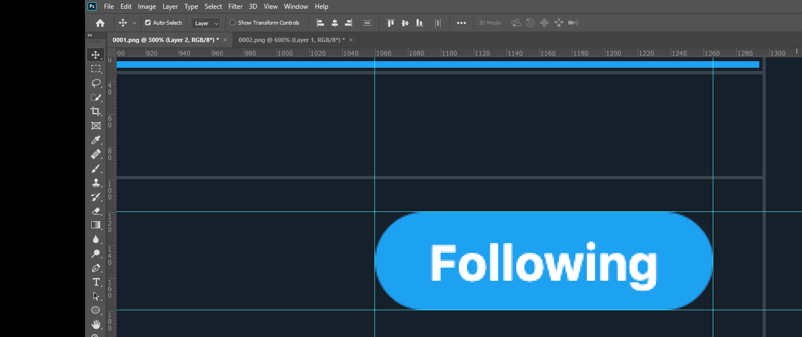
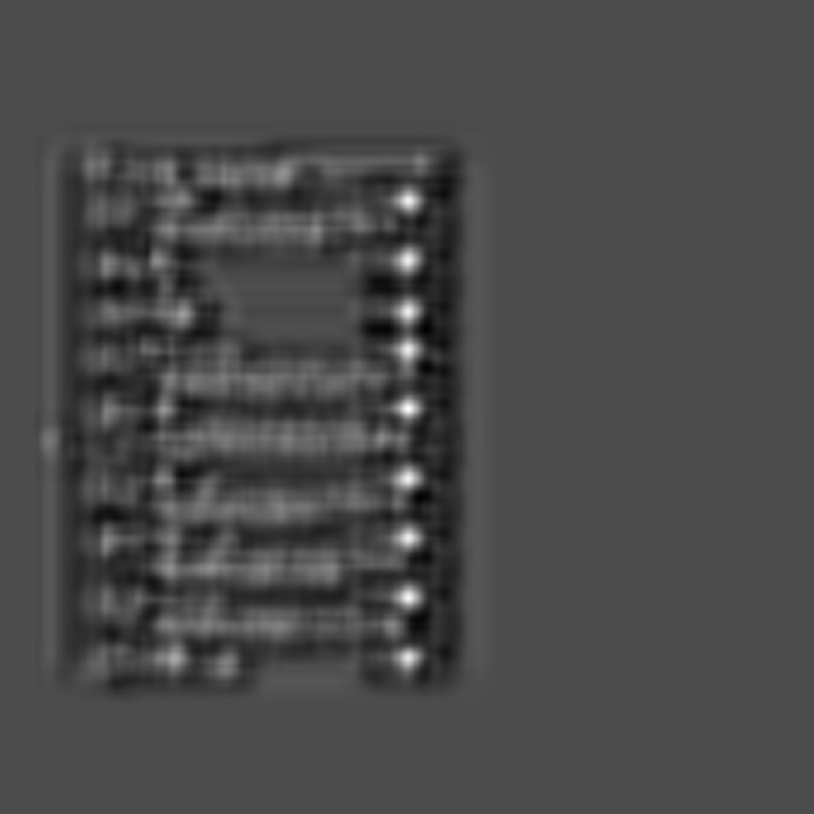

# Remote Roofing Preliminary Challenge
Estimating the bounding boxes for the "following" button in a set of 5 images.

 


- [Remote Roofing Preliminary Challenge](#remote-roofing-preliminary-challenge)
  - [Solution](#solution)
  - [Approach](#approach)
    - [SiamFC](#siamfc)
    - [Process](#process)
  - [Outputs](#outputs)
    - [Intermediate Outputs](#intermediate-outputs)
    - [Final Outputs](#final-outputs)
  - [Code Setup](#code-setup)
      - [With Conda](#with-conda)
      - [From Requirements.txt](#from-requirementstxt)
      - [Manual Installation](#manual-installation)
  - [Tracking](#tracking)
  - [License](#license)

## Task: <!-- omit in toc --> 

Take the [above images](https://www.dropbox.com/sh/qvf4ndku92ap725/AAAK53j-IxCawrtBPETCkT1-a?dl=0) as the training set and output the coordinates for the bounding boxes containing the twitter “following button”.

Your output should be a list of arrays containing the bounding boxes of the following buttons for each picture:
```
[ymin, xmin, ymax, xmax]
```
## Solution
The code is pushed onto the repo as a lightweight version without any data. You need to follow the setup scripts in [this section](#tracking) to download the model and data.

Outputs are present in the `Model_Outputs/` directory for ease of access.
## Approach
By casting the problem as an object tracking problem across the frames (sample images), we are able to estimate bounding boxes.

As a result, there is no need for training. Furthermore, any other button or feature can be tracked across frames as well.

### SiamFC
I am using pretrained SiamFC based on the paper, [Fully-Convolutional Siamese Networks for Object Tracking](https://arxiv.org/abs/1606.09549).


A quick recap, provided a target image $z$ and an image $x$, it outputs an *activation map* with probabilities of $z$ at each location in $x$.

### Process

1. **Identifying the coordinates of the "following button" in any one image :** I used Photoshop to identify the coordinates. The tracker takes in the coordinates of the object in frame #1 and tracks it across frames 
   

2. **Cloning the SiamFC repo:** I used [bilylee's implementation](https://github.com/bilylee/SiamFC-TensorFlow) and set it up as indicated.
3. **Setting up data:** Made a directory ``` assets/TwitterCV/img``` and extracted the images there. Renamed them in the format `0001.png ` (because the tracker datasets usually follow that syntax.)
4. **Adding the initial bounding box :** Created a file `assets/TwitterCV/groundtruth_rect.txt` and added the coordinates obtained in *step 1* in the first row. Made rows for all other samples with junk values as they are necessary  for tracker to consume images. 
   ```python
   1062,836,208,62 #proper bbox in image 1 (x,y,w,h)
   204,41,23,30  #junk lines
   204,41,23,30  #junk lines
   201,40,23,30  #junk lines
   201,40,23,30  #junk lines
   ```
5. **Modifying tracker code:** Changes made to existing code to solve this problem. Siam FC tracks only one object even if identical copies exist in the frame.
    - **_tracker.py:**: 
       - (default behavior): Identify highest activation point and draw bounding box around that point using heuristics.
       - (Modded behavior): Use OpenCV to threshold activation map to identify all regions of high activation. Using OpenCV again to identify centres of these regions and let the system calculate bbox around each centre.
  
    - **run_tracking.py:** Driver code to track
      - Now also reads the bboxes produced by tracker and marks them on the images. Additionally generates a json with the required output `[ymin, xmin, ymax, xmax]`

## Outputs

### Intermediate Outputs
Found in `Logs/SiamFC/track_model_inference/SiamFC-3s-color-pretrained/TwitterCV/Intermediate/`
<div style=" display: flex; ">
<div style="flex: 1; margin-right: 20px; width: 50%;">

  Activation map from SiamFC
</div>
 <div style="width: 50%; ">

  Regions of highest activations after thresholding
</div>
</div>

### Final Outputs

Found in `Logs/SiamFC/track_model_inference/SiamFC-3s-color-pretrained/TwitterCV/Outputs/`

<div>

</div>

The `output.json` in the same folder contains the output bounding boxes.


## Code Setup
The code runs on python 3.6+ .Main requirements can be installed by:

#### With Conda
```bash
cd Remote-Roofing/
conda env create --file environment.yaml
```
#### From Requirements.txt
```bash
cd Remote-Roofing/
pip install -r requirements.txt
```

If `pip` defaults to Python 2.x
```bash
cd Remote-Roofing/
pip3 install -r requirements.txt
```


#### Manual Installation
```bash
# (OPTIONAL) 0. It is highly recommended to create a virtualenv or conda environment
# For example, 
#       conda create -n tensorflow1.4 python=2.7
#       source activate tensorflow1.4

# 1. Install TensorFlow 1.4.0 
# Version 1.4.0 is required for training since we use tf.data API
# You can use TensorFlow > 1.0 for tracking though.
# Note the tracking performance slightly varies in different versions.
# pip install tensorflow    # For CPU
pip install tensorflow-gpu  # For GPU

# 2. Install scipy for loading mat files
pip install scipy

# 3. Install sacred for experiments logging
pip install sacred==0.7.5

# 4. Install matplotlib for visualizing tracking results
pip install matplotlib

# 5. Install opencv for preprocessing training examples
pip install opencv-python

# 6. Install pillow for some image-related operations
pip install pillow

# (OPTIONAL) 7. Install nvidia-ml-py for automatically selecting GPU
pip install nvidia-ml-py
```

## Tracking
```bash
# 1. Clone this repository to your disk
git clone https://github.com/Laxmaan/Remote-Roofing.git

# 2. Change working directory
cd Remote-Roofing/

# 3. Download pretrained models and one test sequence 
python scripts/download_assets.py

# 4. Convert pretrained MatConvNet model into TensorFlow format.
# Note we use SiamFC-3s-color-pretrained as one example. You
# Can also use SiamFC-3s-gray-pretrained. 
python experiments/SiamFC-3s-color-pretrained.py

# 5. Run tracking on the test sequence with the converted model
python scripts/run_tracking.py

```


## License
SiamFC-TensorFlow is released under the MIT License (refer to the LICENSE file for details).
